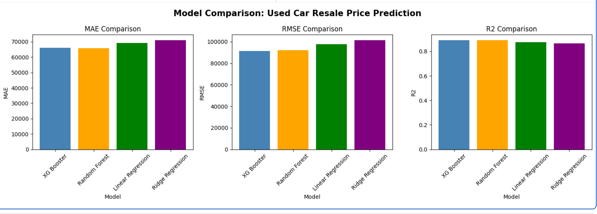
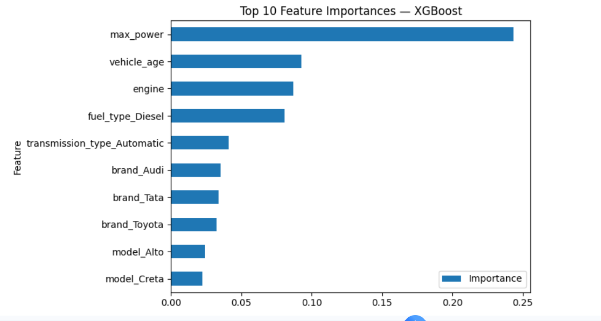

# Used Car Price Estimator
Predicting fair resale prices for used cars in India using machine learning (Cardekho vehicle dataset).

---

## Overview

Used car pricing in India is highly inconsistent — the same model can vary by ₹2–3 lakh depending on where it is listed. This project builds a regression pipeline to predict the fair resale price of a used car based on its specifications, age, usage, and seller details.

---

## Dataset

- **Source:** Cardekho India vehicle listings
- **Size:** ~15,000 rows (≈14,000 after outlier removal)
- **Key features:**
  - `brand`, `model`
  - `vehicle_age`, `km_driven` (transformed to `km_per_year`)
  - `fuel_type`, `transmission_type`, `seller_type`
  - `mileage`, `engine`, `max_power`, `seats`

- **File:** `cardekho_dataset.csv` (included in this repository)

---

## Methods

**Data Cleaning**
- Dropped index and text-only columns (`Unnamed: 0`, `car_name`)
- Removed 1,386 extreme price outliers using the IQR rule (15,411 → 14,025 rows)

**Feature Engineering**
- `km_per_year` = `km_driven / vehicle_age` — normalises usage relative to car age
- `log_price` = `log1p(selling_price)` as the regression target — reduces right skew from 0.839 to -0.533

**Modelling**
- Train–test split (80/20)
- Preprocessing with `ColumnTransformer` inside `sklearn Pipeline`:
  - Numeric: median imputation + standard scaling
  - Categorical: most-frequent imputation + one-hot encoding
- Models compared:
  - Linear Regression — simple baseline
  - Ridge Regression — handles multicollinearity
  - Random Forest — tree based, handles non-linearity
  - XGBoost — gradient boosting, best performer

---

## Results

On the held-out test set (predictions converted back to ₹):

| Model             | MAE (₹) | RMSE (₹) | R²    |
|-------------------|---------|----------|-------|
| **XGBoost**       | **66,023**  | **91,491**   | **0.891** |
| Random Forest     | 65,688  | 91,943   | 0.890 |
| Linear Regression | 69,167  | 97,866   | 0.876 |
| Ridge Regression  | 71,020  | 1,01,439 | 0.866 |

XGBoost is selected as the final model and saved as `car_price_model.pkl`.

---

## Visualisations

### Model Comparison

### Top 10 Feature Importances — XGBoost

---

## Overfitting Check

| Model             | Train R² | Test R² | Gap  | Status            |
|-------------------|----------|---------|------|-------------------|
| Linear Regression | 0.89     | 0.88    | 0.01 |  No Overfitting  |
| Ridge Regression  | 0.89     | 0.88    | 0.01 |  No Overfitting  |
| Random Forest     | 0.98     | 0.89    | 0.09 |  Mild Overfitting |
| XGBoost           | 0.91     | 0.90    | 0.01 |  No Overfitting  |

---

## Key Findings

- `max_power` is the strongest predictor of resale price (importance = 0.24)
- `vehicle_age` is the strongest negative predictor — older cars sell for significantly less
- Engineered `km_per_year` outperformed raw `km_driven` as a usage signal
- All 4 models achieve R² above 0.86 — confirming strong feature selection
- No significant overfitting detected across any model

## Conclusion

This project demonstrates an end-to-end machine learning workflow for used car price prediction.
The final XGBoost model achieved an R² score of 0.891, showing strong performance in estimating resale prices.
